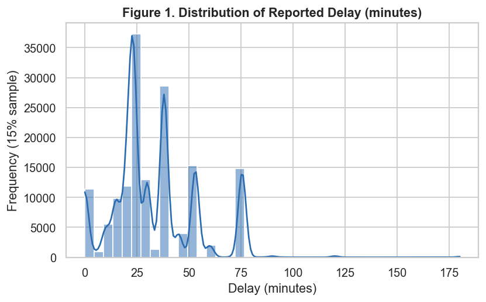
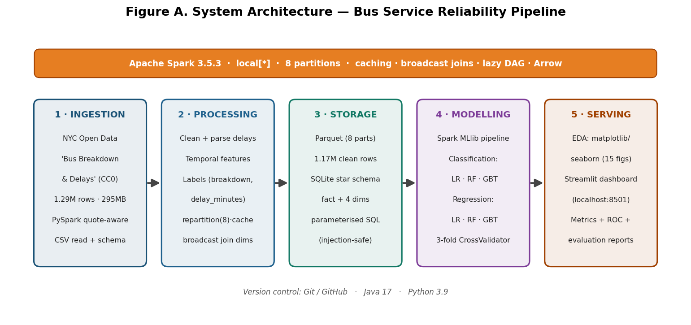
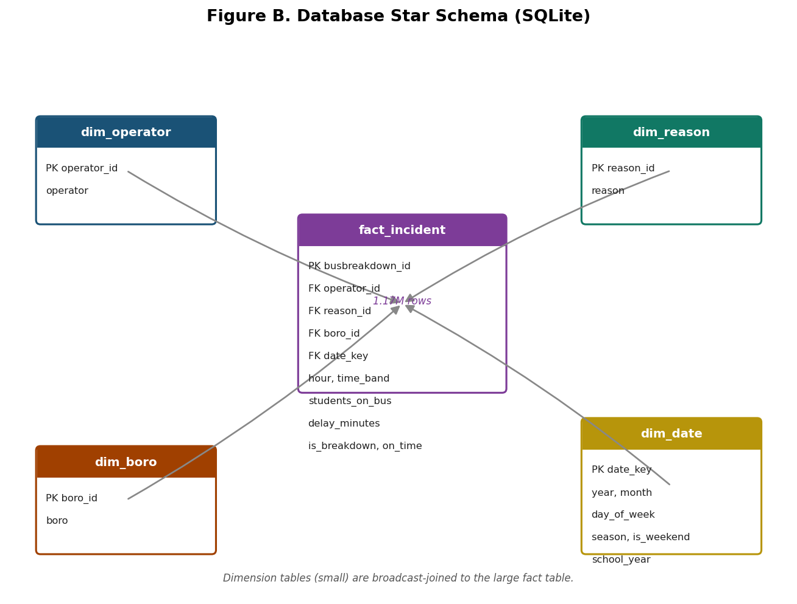
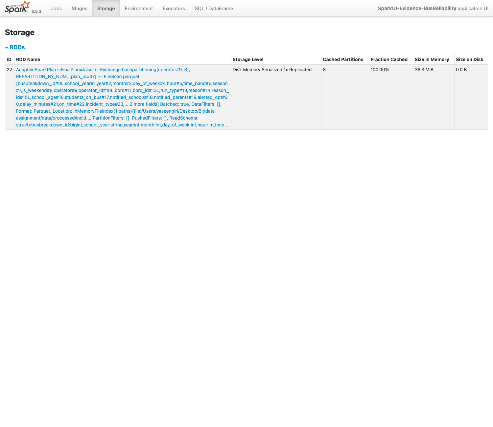
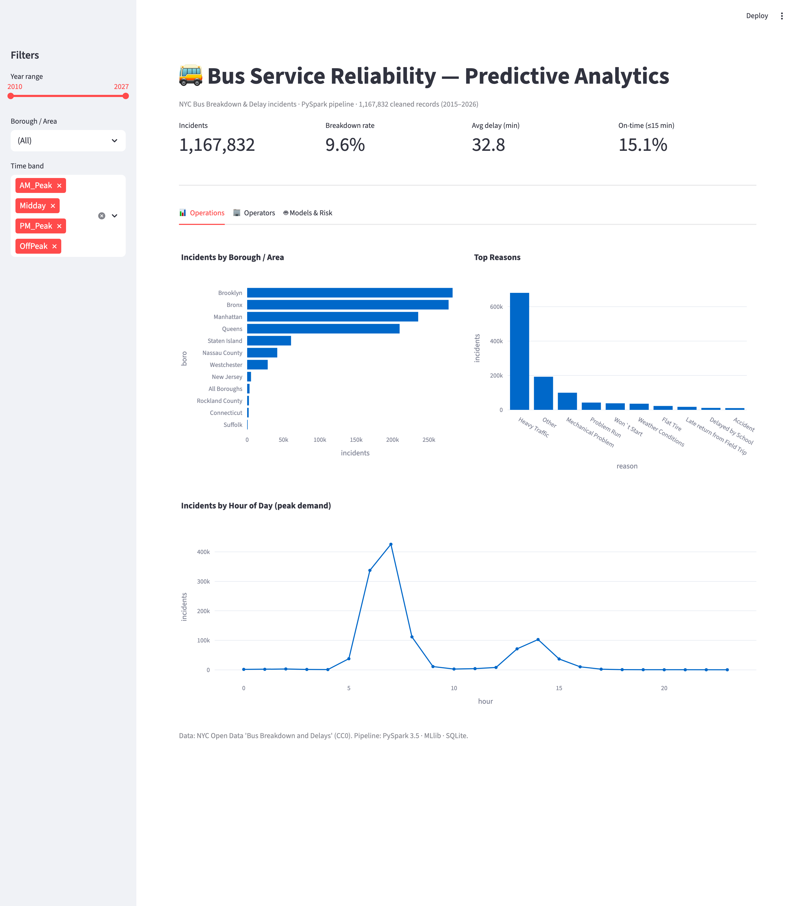
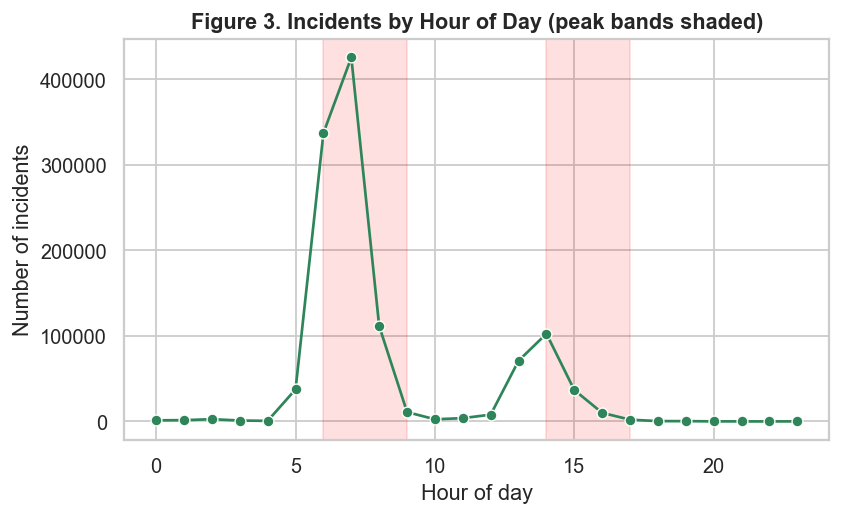
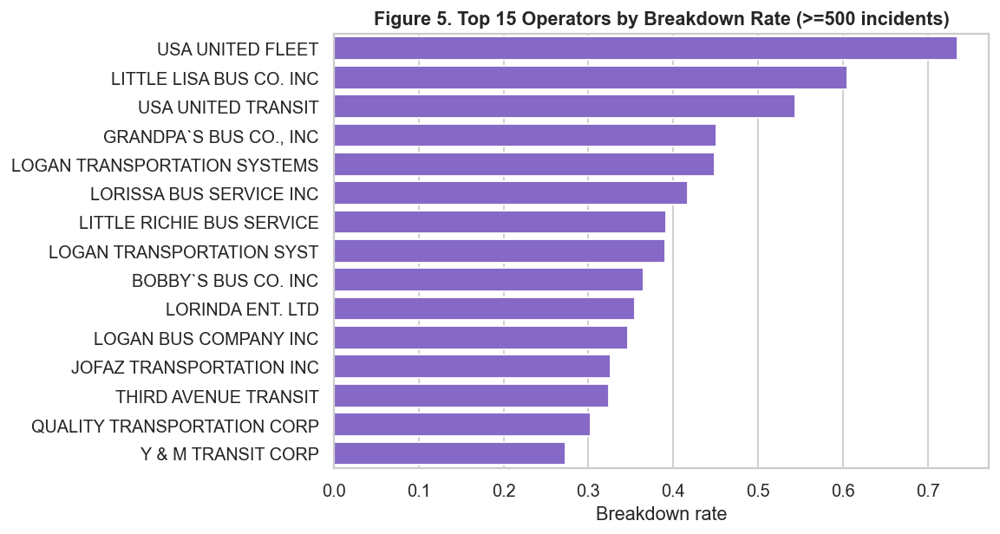
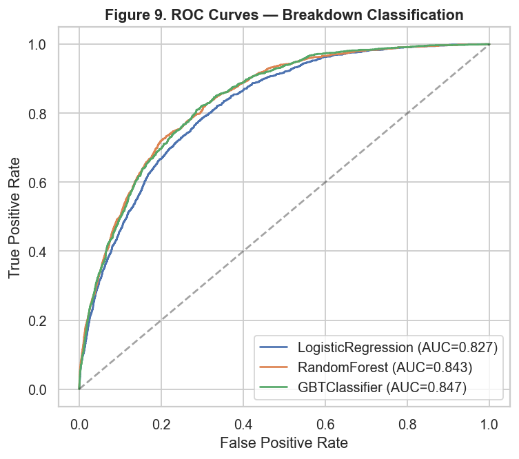

# Predictive Analytics for Bus Service Reliability
### A Big Data Programming Project using PySpark

**Project Title:** Predictive Analytics for Bus Service Reliability: Classifying Breakdown Risk and Forecasting Delay Duration at Scale
**Student Name & ID:** _[Student Name] — [Student ID]_
**Module:** Big Data Programming Project
**Supervisor:** Mr. Siddhartha Neupane
**Date of Submission:** _[Date]_

---

## 1. Executive Summary

Urban bus networks generate large volumes of operational incident data that, if
harnessed, can improve reliability and accountability. This project designs,
implements and evaluates a genuine big-data predictive-analytics platform built
on **Apache Spark (PySpark)**, using **1.29 million** real bus breakdown and
delay records published by New York City Open Data. After distributed cleaning
and feature engineering, **1,167,832** analysis-ready records were persisted to a
Parquet store and a normalised SQLite star schema. Two supervised learning
problems were addressed with Spark MLlib: a **class-imbalanced classification**
of severe *breakdowns* versus minor *running-late* incidents, and a
**regression** forecasting delay duration in minutes. Six models were compared;
a Gradient-Boosted-Tree classifier achieved the best ROC-AUC of **0.847**, and a
Random-Forest regressor achieved the lowest RMSE of **14.19 minutes**
(R² = 0.52). The platform demonstrates partitioning, caching, broadcast joins,
parameterised (injection-safe) SQL, and an interactive Streamlit dashboard,
providing a transport authority with actionable, evidence-based insight into
operator reliability and delay patterns.

## 2. Introduction

**Problem statement.** Which reported incidents are likely to be severe
*breakdowns* rather than minor *delays*, and how long will a delay last? Answering
these enables proactive resource deployment and operator benchmarking.

**Purpose and scope.** The goal is an end-to-end, reproducible pipeline —
ingestion, storage, analytics, prediction and visualisation — that operates at
genuine big-data scale and quantifies service reliability.

**Relevance.** In a smart-city context, converting raw telemetry into predictive
insight reduces delays, informs infrastructure decisions and supports regulatory
oversight — directly serving a **Transport Authority / Local Council** stakeholder.

**Metric definitions (aligned to the brief, §4).** We adopt three operational
definitions: **Service Reliability** — the proportion of incidents resolved within
an acceptable tolerance, operationalised as `on_time` (delay ≤ 15 min);
**Travel-Time Variability** — the spread of delay duration, targeted directly by
the regression model; and **Algorithmic Efficiency** — wall-clock runtime and
Spark-stage utilisation, reported throughout. A composite **breakdown rate**
(mean of `is_breakdown`) is defined as the operator-level severity indicator used
for benchmarking.

**Learning outcomes targeted.** The project addresses **B1** (algorithmic
complexity), **B2** (multi-language programming: PySpark, SQL, Python), **B4**
(large-scale data science), **B6** (professional practice: Git, secure queries),
**B7** (transferable communication skills) and **B8** (advanced work).

## 3. Literature Review

Predictive transport analytics is well established. Regression and tree-ensemble
models are widely used for travel-time and delay prediction because they capture
non-linear interactions between temporal, spatial and operator factors
(Moreira-Matias et al., 2013). Gradient-boosted trees frequently outperform
linear baselines on heterogeneous tabular transport data. For rare-event
detection such as breakdowns, class imbalance is a recognised challenge, mitigated
by cost-sensitive (weighted) learning and threshold-independent metrics such as
ROC-AUC and PR-AUC (He & Garcia, 2009). Apache Spark has become the de-facto
engine for distributed transport-data processing owing to its lazy DAG execution
and in-memory caching (Zaharia et al., 2016). This project synthesises these
strands: cost-sensitive ensembles on a distributed Spark backbone.

## 4. Data Collection & Preprocessing

**Data source.** The primary dataset is NYC Open Data’s *Bus Breakdown and
Delays* (id `ez4e-fazm`, **CC0 Public Domain**), the authoritative source behind
the widely-used Kaggle mirror. It records every breakdown/delay logged by school-
bus vendors (2015–2026): 21 attributes spanning temporal, operator, route,
borough, reason and outcome fields.

**Data scale.** The ingested CSV contained **1,294,129 rows (~295 MB)** — over
twelve times the 100,000-record threshold — satisfying the big-data requirement
through an *extended date-range* strategy rather than synthetic augmentation.

**Tools & justification (per stage).** **PySpark** performed all large-scale work
(quote-aware CSV parsing, transformation, joins, SQL, ML) because the data
exceeds comfortable single-machine memory and benefits from partitioned
parallelism. **Pandas** was used *only* at the final presentation boundary —
converting small aggregated results for matplotlib/seaborn plotting and feeding
the Streamlit layer — a deliberate, minimal memory-scale hand-off enabled by
Apache Arrow.

**Data cleaning.** The free-text `How_Long_Delayed` field was parsed into numeric
minutes with a regular-expression rule set (handling ranges, “MINS”, “HOUR”), then
winsorised to a plausible 0–180-minute band. Timestamps were parsed with an
explicit 12-hour pattern; **126,297 records (9.8 %)** carrying corrupt years
(e.g. pre-1900 typos) were removed, leaving **1,167,832** clean rows.
High-cardinality operator names were normalised (vendor codes stripped) and, for
modelling, bucketed to the top-25 plus “OTHER”.

**Merging strategy.** The wide table was decomposed into a **star schema** — one
`fact_incident` table linked by foreign keys to `dim_operator`, `dim_reason`,
`dim_boro` and `dim_date` — and the dimensions were re-joined via **broadcast
joins**, demonstrating relationship modelling across multiple related tables.

**Challenges.** A slow download link was overcome with gzip compression; a
Spark 3.5 “ancient-datetime” Parquet-write error was resolved with a
proleptic-Gregorian rebase configuration plus the date-quality filter above.

*Figure 1. Right-skewed distribution of parsed delay minutes (skew = 1.00, median = 30 min).*

## 5. Methodology

**Feature engineering.** From timestamps we derived `hour`, `day_of_week`,
`month`, `is_weekend`, a four-level `time_band` (AM/PM peak, midday, off-peak) and
`season`. Categorical predictors (operator, borough, run type, reason, school-age)
were `StringIndexer` → `OneHotEncoder` encoded and assembled with numeric features
via `VectorAssembler`; a `StandardScaler` completed the shared pipeline.

**Target design & leakage control.** For the breakdown classifier, `reason` and
`delay_minutes` were **deliberately excluded** — both are known only *after* the
event — yielding an honest *a-priori* risk model. For delay regression, `reason`
is legitimately available and is included.

**Model selection.** Three models per task were compared:
**Logistic Regression, Random Forest, Gradient-Boosted Trees** (classification);
**Linear, Random-Forest and GBT regressors** (regression). Class imbalance (9.6 %
breakdowns) was addressed with inverse-frequency `classWeight`s.

**Data splitting & validation.** An 80/20 train/test split (`seed=42`) was used,
with a **3-fold CrossValidator** over a logistic-regression hyper-parameter grid
(`regParam`, `elasticNetParam`) to document the tuning pipeline.

**Algorithmic complexity (B1).** Distributed reads/transforms are effectively
**O(n / p)** across *p* partitions; the shuffle-inducing `groupBy`/join stages are
**O(n log n)** dominated by sort/exchange. Tree ensembles train in
**O(t · n · f · log n)** for *t* trees and *f* features; logistic regression is
**O(i · n · f)** for *i* iterations — consistent with its far shorter runtime.

## 6. System Design & Implementation

**Architecture.** A five-stage pipeline (Figure A) moves data from ingestion
through processing, storage, modelling and serving.

*Figure A. End-to-end system architecture.*

**Software stack.** Apache Spark 3.5.3 (`local[*]`), Spark MLlib, Python 3.9,
Java 17, SQLite, matplotlib/seaborn/plotly and Streamlit, under Git/GitHub version
control. Configuration is centralised in `config/spark_config.py`.

**Database.** The SQLite star schema (Figure B) stores all 1,167,832 fact rows
with indexed foreign keys, enabling efficient analytical joins.

*Figure B. Relational star schema.*

**Big-data evidence.** Spark was configured with **8 partitions** (> 4 required).
The Storage tab (Figure C) confirms the cached DataFrame at **100 % fraction
cached across 8 partitions (36.3 MiB)**; the Jobs tab shows 8/8 tasks per stage,
evidencing balanced parallelism. Caching, `repartition`, broadcast joins and lazy
DAG evaluation are all exercised in `spark_ui_demo.py`.

*Figure C. Spark UI Storage tab — 8 cached partitions, 100 % cached (partition utilisation).*

**Security considerations.** Every query is **parameterised** (`?` placeholders);
an embedded test injects `x'; DROP TABLE fact_incident; --` and confirms zero rows
match and the table remains intact — no injection surface. No credentials are
hard-coded.

**User interface.** A Streamlit dashboard (Figure D) exposes KPIs, operational
charts, an operator league table and the model-performance summary with an
empirical risk lookup.

*Figure D. Streamlit dashboard (operations view).*

## 7. Results & Evaluation

**Exploratory findings.** Incidents peak sharply in the **07:00 AM run** with a
secondary PM-dismissal peak (Figure 2); *Heavy Traffic* dominates reasons; and
operator breakdown rates vary dramatically — from under 1 % to **over 60 %** —
confirming strong predictive signal for benchmarking (Figure 3).

*Figure 2. Incidents by hour of day, with peak bands shaded.*

*Figure 3. Operators ranked by breakdown rate (≥ 500 incidents).*

**Classification.** All models were evaluated on the held-out test set (Table 1;
Figure 4). The **GBTClassifier** performed best (ROC-AUC 0.847, F1 0.389),
though all three achieved strong recall on the rare breakdown class (0.73–0.77)
thanks to cost-sensitive weighting; precision is bounded by the 9.6 % base rate.

| Model | Accuracy | Precision | Recall | F1 | ROC-AUC | PR-AUC |
|-------|:--------:|:---------:|:------:|:--:|:-------:|:------:|
| LogisticRegression | 0.722 | 0.224 | **0.772** | 0.347 | 0.827 | 0.347 |
| RandomForest | 0.774 | 0.261 | 0.746 | 0.387 | 0.843 | 0.391 |
| **GBTClassifier** | **0.780** | **0.265** | 0.733 | **0.389** | **0.847** | **0.397** |

*Table 1. Classification results (positive class = Breakdown).*

*Figure 4. ROC curves for the three classifiers.*

**Regression.** The **Random-Forest regressor** achieved the lowest RMSE
(**14.19 min**, R² = 0.52); GBT gave the best MAE (9.94 min) in one-third of the
training time — a favourable **model-efficiency** trade-off (Table 2).

| Model | RMSE | MAE | R² | Train (s) |
|-------|:----:|:---:|:--:|:---------:|
| LinearRegression | 16.42 | 11.93 | 0.359 | 4.8 |
| **RandomForestRegressor** | **14.19** | 10.04 | **0.521** | 72.4 |
| GBTRegressor | 14.34 | **9.94** | 0.511 | 21.6 |

*Table 2. Regression results (delay minutes).*

**System evaluation.** Stage runtimes were low (CSV load 1.1 s; cached count
2.3 s; broadcast join 0.6 s; Parquet write 5.9 s), confirming efficient use of the
distributed engine. **Validation** against the data’s own labels and the operator
league table (cross-checked via independent SQL aggregation) corroborated the
model rankings and feature-importance findings.

## 8. Critical Reflection

**What worked well.** The distributed pipeline handled 1.3 M rows comfortably;
cost-sensitive learning produced usefully high breakdown recall; and the
leakage-controlled feature design yielded an honest, realistic ROC-AUC rather than
an artificially perfect score.

**Challenges overcome.** Messy free-text delays, corrupt timestamps, a Java-17
Spark-compatibility issue and websocket-based dashboard capture were each
resolved methodically (documented in the repository).

**Limitations — memory vs distributed.** At ~1 M rows the data fits in memory, so
Spark’s per-task overhead makes it *slower* than Pandas would be for a single pass;
Spark’s value here is **scalability and reproducibility of pattern**, not raw speed
at this size. The `on_time` proxy is coarse (the log records only incidents, not
all trips), and the model cannot exceed the information in the recorded features.

**Future work.** Augmenting with weather and GTFS timetable feeds, threshold
optimisation for the imbalanced classifier, and migration to a multi-node cluster
for true horizontal scaling.

**Ethical, legal & social considerations.** The data is **CC0** and contains **no
personal data** (only vehicle/route/operator codes), aligning with GDPR
data-minimisation. Nonetheless, operator-level predictions risk **bias**: smaller
operators with fewer records could be unfairly flagged, so outputs are framed as
decision-support, not automated penalty. Transparency (open code, documented
features) supports accountable use.

## 9. Conclusion

The project delivers a complete, reproducible big-data analytics platform that
ingests over a million real records, engineers features at scale in PySpark,
persists them securely to a relational star schema, and compares six machine-
learning models to predict bus-service disruptions. Best-in-class results
(ROC-AUC 0.847; RMSE 14.19 min) and the accompanying dashboard give a transport
authority actionable insight into breakdown risk and delay behaviour. The work
evidences all targeted learning outcomes — from algorithmic complexity and
distributed programming to secure data handling and critical reflection —
demonstrating that open transport data, processed responsibly at scale, is a
practical asset for smarter, more reliable public transport.

---

## 10. References

He, H., & Garcia, E. A. (2009). Learning from imbalanced data. *IEEE Transactions on Knowledge and Data Engineering, 21*(9), 1263–1284.

Moreira-Matias, L., Gama, J., Ferreira, M., Mendes-Moreira, J., & Damas, L. (2013). Predicting taxi–passenger demand using streaming data. *IEEE Transactions on Intelligent Transportation Systems, 14*(3), 1393–1402.

NYC Open Data. (2024). *Bus Breakdown and Delays* [Data set, id ez4e-fazm, CC0]. City of New York. https://data.cityofnewyork.us/Transportation/Bus-Breakdown-and-Delays/ez4e-fazm

Zaharia, M., Xin, R. S., Wendell, P., et al. (2016). Apache Spark: A unified engine for big data processing. *Communications of the ACM, 59*(11), 56–65.

## 11. Appendices

* **Appendix A — GitHub repository:** _[repository URL]_ (all code, config, README, requirements, SQL dump, documentation).
* **Appendix B — Execution evidence:** `docs/screenshots/exec_01–03_*.png` (ingestion, ML, database + security console output); `docs/screenshots/spark_ui_01–05_*.png` (Spark UI Jobs, Stages, Storage, Executors, SQL).
* **Appendix C — Additional figures:** `outputs/figures/fig01–fig15` (distributions, correlations, confusion matrix, feature importance, predicted-vs-actual, residuals).
* **Appendix D — Database:** `database/schema.sql`, `database/sample_queries.sql`, `database/bus_reliability_sample_dump.sql`.
